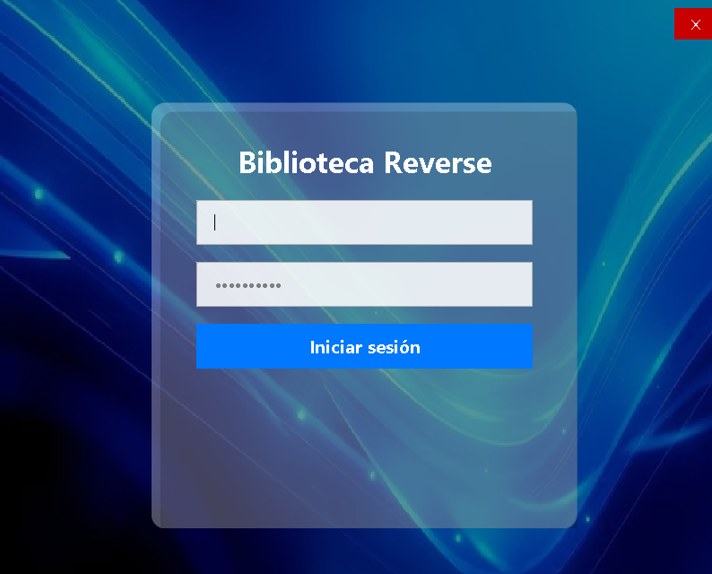
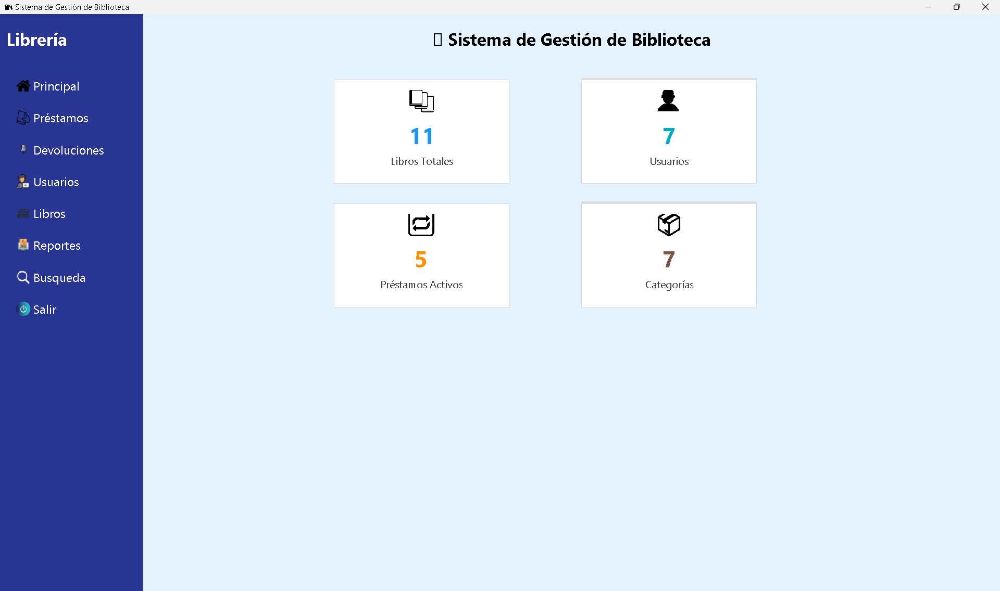
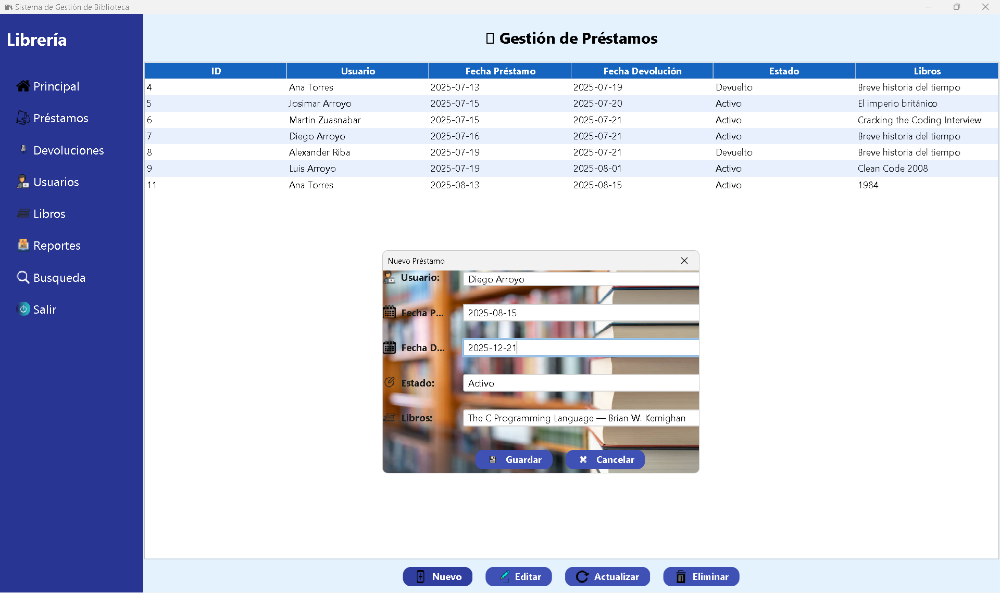
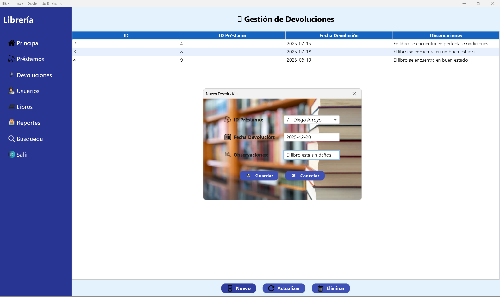
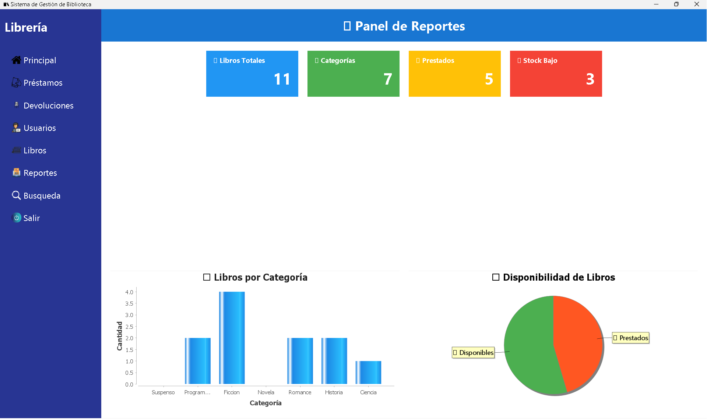

<p align="center"> 
  <a href="README.en.md">
    
  </a> 
  <a href="README.md">
    
  </a> 
</p>

# 📚 Library System - Java Desktop Application


<p align="center">
  
  
  
  
  
</p>

<p align="center">
  <strong>Comprehensive system for managing loans, returns, users, and books</strong><br/>
  Developed with layered architecture, database connectivity, and professional report generation
</p>

---

## 🚀 Key Features

<table>
<tr>
<td width="50%">

### 📖 **Library Management**
- ✅ Book registration and administration  
- ✅ Loan and return control  
- ✅ User management (readers and administrators)  
- ✅ Advanced search by titles, authors, or categories  

</td>
<td width="50%">

### 🏗️ **System Architecture**
- ✅ MVC pattern implementation  
- ✅ Database connection with JDBC  
- ✅ Swing GUI interface  
- ✅ Reports and statistics exportable to PDF  

</td>
</tr>
</table>

---

## 🖼️ System Screenshots

<div align="center">

### 🔑 Login Screen


### 📌 Main Interface


### 📕 Loan Management


### 📗 Return Management


### 📊 Reports


</div>

---

## 🛠️ Technology Stack

<div align="center">

| Technology | Version | Purpose |
|:----------:|:-------:|:---------:|
|  | 17 LTS | Business logic and GUI |
|  | 3.8+ | Build automation and dependency management |
|  | 8.0 | Relational database |
|  | Latest | Database connectivity |
|  | Built-in | Graphical interface |
|  | 6.x | Report generation |

</div>

---

## 📁 Project Architecture

```
📦 SistemaBibliotecaJava/
├── 📂 src/
│   ├── 📂 main/
│   │   ├── 📂 java/
│   │   │   ├── 📂 principal/          # Main menu
│   │   │   ├── 📂 prestamos/          # Loans module
│   │   │   ├── 📂 devoluciones/       # Returns module
│   │   │   ├── 📂 usuarios/           # User management
│   │   │   ├── 📂 libros/             # Book management
│   │   │   ├── 📂 reportes/           # PDF reports
│   │   │   ├── 📂 busqueda/           # Search module
│   │   │   ├── 📂 conexion/           # Database connection
│   │   │   └── 📂 salir/              # Logout and exit
│   │   └── 📂 resources/
│   │       ├── 📂 img/                # Application images
│   │       └── 📂 reports/            # JasperReports templates
├── 📂 target/                         # Compiled classes
└── 📄 pom.xml                         # Maven configuration
```

---

## ⚡ Implemented Features

### 👥 **User Management**
- Student and administrator registration  
- Access control with login  
- User loan history  

### 📚 **Book Management**
- Book registration, editing, and deletion  
- Stock and availability control  
- Classification by categories  

### 🔄 **Loans and Returns**
- Active loan registration  
- Due date control  
- Returns with automatic stock updates  

### 📊 **Reports**
- Reports of borrowed and returned books  
- Library usage statistics  
- **PDF** export  

---

## 🚀 Installation and Setup

### Prerequisites
```bash
☕ Java 17 or higher
🛢️ MySQL 8.0+
```

### Installation Steps

1. **Clone the repository**
```bash
git clone https://github.com/Reverse07/SistemaBibliotecaJava.git
cd SistemaBibliotecaJava
```

2. **Configure database**
```sql
CREATE DATABASE biblioteca;
USE biblioteca;
-- Import script with tables and initial data
```

3. **Configure connection**
Edit `conexion/CConexion.java`:
```java
String url = "jdbc:mysql://localhost:3306/biblioteca";
String user = "your_username";
String password = "your_password";
```

4. **Run the project**
   - From your IDE (NetBeans/IntelliJ)
   
   Or with console:
```bash
javac -cp "lib/*:src" src/principal/Main.java
java -cp "lib/*:src" principal.Main
```

---

## 📈 Project Metrics

<div align="center">


</div>

---

## 🤝 Contributing

Contributions are welcome. To contribute:

1. Fork the project
2. Create a branch (`git checkout -b feature/NewFeature`)
3. Commit your changes (`git commit -m 'Added new feature'`)
4. Push to the branch (`git push origin feature/NewFeature`)
5. Open a Pull Request

---

## 📝 License

This project is under the MIT License. See `LICENSE` for more details.

---

## 📞 Contact and Support

<div align="center">

**Diego Arroyo**  
*Java Developer | Systems Engineering Student*

[](https://github.com/Reverse07)
[](https://linkedin.com/in/your-profile)
[](mailto:your.email@gmail.com)

</div>

---

## 🌟 Did you like the project?

If this project was useful to you, consider giving it a ⭐ on GitHub!

<div align="center">

**Developed with ❤️ for efficient library management**


</div>
